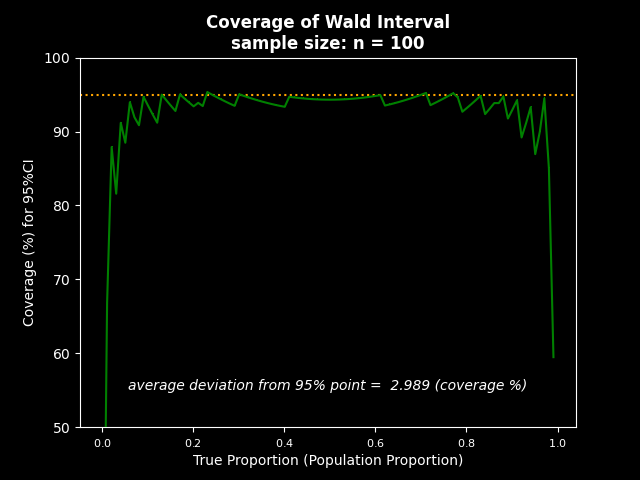
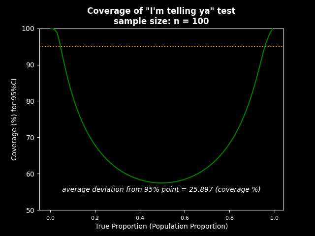
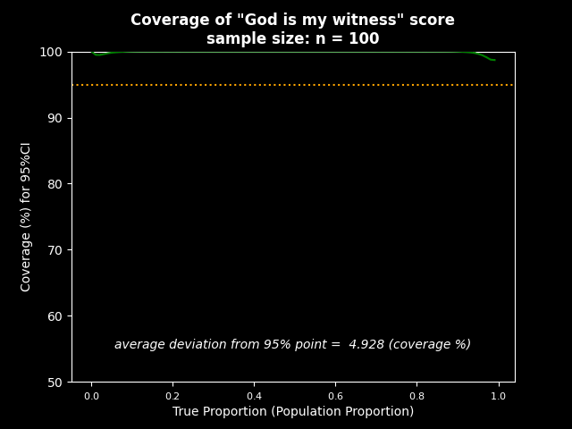

# CI methods analyser
A toolkit for measuring the efficacy of various methods for calculating a confidence interval.
Currently provides with a toolkit for measuring the efficacy of methods for a confidence interval for the following statistics:

 - proportion
 - difference between two proportions

This article was one of the main inspiratons for the library:
["Five Confidence Intervals for Proportions That You Should Know About" by Dr. Dennis Robert](https://towardsdatascience.com/five-confidence-intervals-for-proportions-that-you-should-know-about-7ff5484c024f)


## Usage

### Testing Wald Interval - a popular method for calculating confidence interval for proportion

```python
from CI_methods_analyser import CImethodForProportion_efficacyToolkit as toolkit, methods_for_CI_for_proportion

# take an already implemented method for calculating CI for proportions
wald_interval = methods_for_CI_for_proportion.wald_interval

# initialize the toolkit
wald_interval_test_toolkit = toolkit(
    method=wald_interval, method_name="Wald Interval")


# calculate the real coverage that the method produces
# for each case of a true population proportion (taken from the list `proportions`)
wald_interval_test_toolkit.calculate_coverage_analytically(
    sample_size=100, proportions=('0.001', '0.999', '0.01'), confidence=0.95)
# now you can access the calculated coverage and a few statistics:
# wald_interval_test_toolkit.coverage  # 1-d array of 0-100, the same shape as passed `proportions`
# wald_interval_test_toolkit.average_coverage  # np.longdouble 0-100, avg of `coverage`
# wald_interval_test_toolkit.average_deviation  # np.longdouble 0-100, avg abs diff w/ `confidence`

# plots the calculated coverage in a matplotlib.pyplot figure
wald_interval_test_toolkit.plot_coverage(
    plt_figure_title="Wald Interval coverage", theme="dark_background")
# you can access the figure here:
# wald_interval_test_toolkit.figure

# shows the figure (non-blocking)
wald_interval_test_toolkit.show_plot()

# because show_plot() is non-blocking,
# you have to pause the execution in order for the figure to be rendered completely
input('press Enter to exit')

```

The will output the image:



The plot indicates overall bad performance of the method and particularly poor performance for extreme proportions.


Using the shortcut function `.calculate_coverage_and_show_plot` will have an equivalent effect and render the same picture:


```python
from CI_methods_analyser import CImethodForProportion_efficacyToolkit as toolkit, methods_for_CI_for_proportion

wald_interval_test_toolkit = toolkit(
    method=methods_for_CI_for_proportion.wald_interval, method_name="Wald Interval")


wald_interval_test_toolkit.calculate_coverage_and_show_plot(
    sample_size=100, proportions=('0.001', '0.999', '0.01'), confidence=0.95
    plt_figure_title="Wald Interval coverage", theme="dark_background"
)


input('press Enter to exit')


```

<br>

### Testing custom method for CI for proportion

You can implement your own methods and test them:

```python
from CI_methods_analyser import CImethodForProportion_efficacyToolkit as toolkit
from CI_methods_analyser.math_functions import normal_z_score_two_tailed
from functools import lru_cache

# not a particularly good method for calculating CI for proportion
@lru_cache(100_000)
def im_telling_ya_test(x: int, n: int, conflevel: float = 0.95):
    z = normal_z_score_two_tailed(conflevel)

    p = float(x)/n
    return (
        p - 0.02*z,
        p + 0.02*z
    )


toolkit(
    method=im_telling_ya_test, method_name='"I\'m telling ya" test'
).calculate_coverage_and_show_plot(
    sample_size=100, proportions=('0.001', '0.999', '0.01'), confidence=0.95,
    plt_figure_title='"I\'m telling ya" coverage', theme='dark_background'
)


input('press Enter to exit')

```



```python
# you could say, this method is "too good"
@lru_cache(100_000)
def God_is_my_witness_score(x: int, n: int, conflevel: float = 0.95):
    z = normal_z_score_two_tailed(conflevel)

    p = float(x)/n
    return (
        (0 + p)/2 - 0.005*z,
        (1 + p)/2 + 0.005*z
    )


toolkit(
    method=God_is_my_witness_score, method_name='"God is my witness" score'
).calculate_coverage_and_show_plot(
    sample_size=100, proportions=('0.001', '0.999', '0.01'), confidence=0.95,
    plt_figure_title='"God is my witness" score coverage', theme='dark_background'
)

input('press Enter to exit')
```




### Testing methods for CI for the difference between two proportions


<br>
<br>

## NOTES

### Methods for measuring efficacy of CI methods
Two ways can be used to calculate the efficacy of CI methods:
 - approximately, with random simulation (as implemented in R by Dr. Dennis Robert, see link above)
 - precisely, with the analytical solution

Both methods are implemented here for CI for both statistics: *proportion*, and *difference between two proportions*. For the precise analytical solution, an optimization was made. Theoretically, it is lossy, but practically the error is always negligible (as proven by `test_z_precision_difference.py`). Optimization is regulated with the parameter `z_precision`, which is calculated automatically by default.


## Various links
**1. Equivalence and Noninferiority Testing (as I understand, are fancy terms for 2-sided and 1-sided p tests for the difference between two proportions)**
 - **[https://ncss-wpengine.netdna-ssl.com/wp-content/themes/ncss/pdf/Procedures/PASS/Confidence_Intervals_for_the_Difference_Between_Two_Proportions.pdf](https://ncss-wpengine.netdna-ssl.com/wp-content/themes/ncss/pdf/Procedures/PASS/Confidence_Intervals_for_the_Difference_Between_Two_Proportions.pdf) **
 - **[https://ncss-wpengine.netdna-ssl.com/wp-content/themes/ncss/pdf/Procedures/PASS/Non-Inferiority_Tests_for_the_Difference_Between_Two_Proportions.pdf](https://ncss-wpengine.netdna-ssl.com/wp-content/themes/ncss/pdf/Procedures/PASS/Non-Inferiority_Tests_for_the_Difference_Between_Two_Proportions.pdf) **
 - [https://www.ncss.com/wp-content/themes/ncss/pdf/Procedures/NCSS/Two_Proportions-Non-Inferiority,_Superiority,_Equivalence,_and_Two-Sided_Tests_vs_a_Margin.pdf](https://www.ncss.com/wp-content/themes/ncss/pdf/Procedures/NCSS/Two_Proportions-Non-Inferiority,_Superiority,_Equivalence,_and_Two-Sided_Tests_vs_a_Margin.pdf) 
 - [https://www.ncbi.nlm.nih.gov/pmc/articles/PMC3019319/](https://www.ncbi.nlm.nih.gov/pmc/articles/PMC3019319/)
 - [https://www.ncbi.nlm.nih.gov/pmc/articles/PMC2701110/](https://www.ncbi.nlm.nih.gov/pmc/articles/PMC2701110/)
 - [https://pubmed.ncbi.nlm.nih.gov/9595617/](https://pubmed.ncbi.nlm.nih.gov/9595617/)
 - [http://thescipub.com/pdf/10.3844/amjbsp.2010.23.31](http://thescipub.com/pdf/10.3844/amjbsp.2010.23.31) 

**2. Biostatistics course (Dr. Nicolas Padilla Raygoza, et al.)**
 - [https://docs.google.com/presentation/d/1t1DowyVDDRFYGHDlJgmYMRN4JCrvFl3q/edit#slide=id.p1](https://docs.google.com/presentation/d/1t1DowyVDDRFYGHDlJgmYMRN4JCrvFl3q/edit#slide=id.p1) 
 - [https://www.google.com/search?q=Dr.+Sc.+Nicolas+Padilla+Raygoza+Biostatistics+course+Part+10&oq=Dr.+Sc.+Nicolas+Padilla+Raygoza+Biostatistics+course+Part+10&aqs=chrome..69i57.3448j0j7&sourceid=chrome&ie=UTF-8](https://www.google.com/search?q=Dr.+Sc.+Nicolas+Padilla+Raygoza+Biostatistics+course+Part+10&oq=Dr.+Sc.+Nicolas+Padilla+Raygoza+Biostatistics+course+Part+10&aqs=chrome..69i57.3448j0j7&sourceid=chrome&ie=UTF-8) 
 - [https://slideplayer.com/slide/9837395/](https://slideplayer.com/slide/9837395/)

**3. Using z-test instead of a binomial test:**
 - When can use [https://stats.stackexchange.com/questions/424446/when-can-we-use-a-z-test-instead-of-a-binomial-test](https://stats.stackexchange.com/questions/424446/when-can-we-use-a-z-test-instead-of-a-binomial-test) 
 - How to use [https://cogsci.ucsd.edu/~dgroppe/STATZ/binomial_ztest.pdf](https://cogsci.ucsd.edu/~dgroppe/STATZ/binomial_ztest.pdf) 

